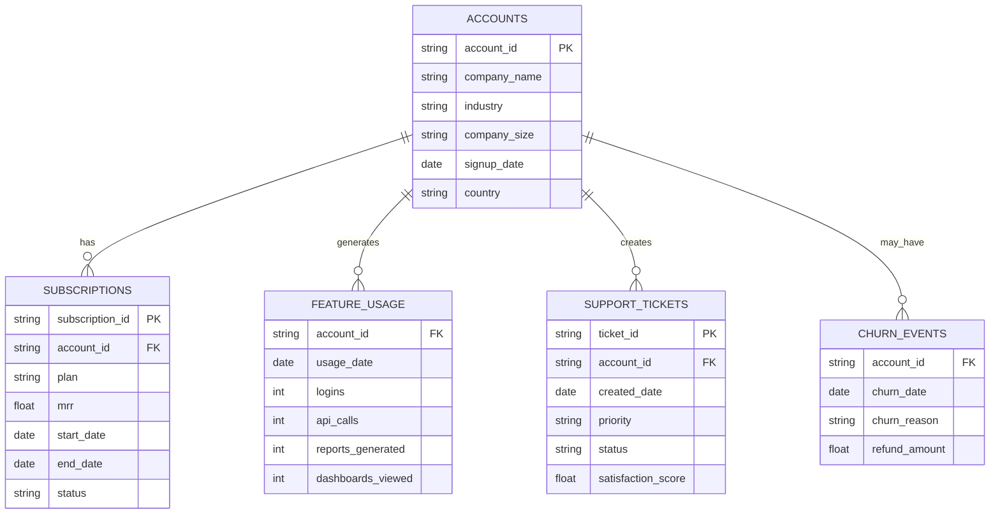

# Stage 1 — Problem Definition & Success Criteria

> **Project:** SaaS Churn Prediction Engine  
> **Dataset:** [RavenStack — SaaS Subscription & Churn Analytics](https://www.kaggle.com/datasets/rivalytics/saas-subscription-and-churn-analytics-dataset)  
> **Classification:** Binary (churn_flag ∈ {0, 1})  
> **Stakeholders:** Customer Success · Revenue Operations · Finance

---

## 1. Problem Statement

### Business Context

In a B2B SaaS business, **retaining existing ARR is 5–7× cheaper than acquiring new revenue**. When a customer churns, the company loses:

| Loss Category | Impact |
|---|---|
| **Direct MRR/ARR loss** | Immediate top-line revenue reduction |
| **Expansion revenue** | Foregone upsell / cross-sell from that account |
| **Acquisition cost write-off** | CAC that was never recovered through LTV |
| **Brand & referral damage** | Negative word-of-mouth in market segments |

### The Problem

> **"RavenStack's Customer Success team currently operates reactively — reaching out to accounts only after churn signals are already visible (e.g., cancellation requests, support escalations). By the time these signals surface, it is often too late to intervene effectively. The company lacks a systematic, data-driven early-warning system to identify at-risk accounts before revenue is lost."**

### What We Are Building

A **binary classification model** that produces a **daily scored list of accounts ranked by churn probability**, enabling Customer Success and Revenue teams to:

1. **Prioritize outreach** — Focus finite CS bandwidth on the accounts most likely to churn within the next billing cycle.
2. **Trigger automated interventions** — Feed scores into CRM / marketing-automation workflows (e.g., discount offers, executive check-ins, onboarding replays).
3. **Protect ARR/MRR** — Proactively save revenue that would otherwise be lost, directly measurable as "saved ARR."

### Formal Definition

```
Given:  A customer account a with features X_a derived from
        accounts, subscriptions, feature_usage, and support_tickets tables.

Predict: P(churn = 1 | X_a)  — the probability that account a will
         churn within the next billing cycle.

Output:  A ranked list of accounts sorted by descending churn probability,
         delivered daily to the CS team dashboard.
```

---

## 2. Success Metrics

### 2.1 Business Metrics (measured post-deployment)

| Metric | Definition | Target |
|---|---|---|
| **Churn Rate Reduction** | % decrease in monthly churn rate vs. pre-model baseline | ≥ 15% relative reduction |
| **At-Risk Accounts Identified** | % of actual churners that appeared in the model's top-decile risk list before churning | ≥ 70% capture rate |
| **Saved ARR** | $ value of accounts flagged as at-risk that were successfully retained after CS intervention | Track & grow quarter-over-quarter |
| **CS Efficiency** | Ratio of successful saves to total outreach attempts driven by model | ≥ 30% success rate |
| **Time-to-Intervention** | Average days between model flag and first CS touchpoint | ≤ 3 business days |

### 2.2 Technical Metrics (measured during model development)

| Metric | Why It Matters | Minimum Threshold | Stretch Goal |
|---|---|---|---|
| **Recall (churn class)** | Missing a churner is costlier than a false alarm; we must catch most churners | ≥ 0.75 | ≥ 0.85 |
| **F1-Score (churn class)** | Balances recall with precision — too many false positives waste CS bandwidth | ≥ 0.65 | ≥ 0.75 |
| **ROC-AUC** | Overall discriminative power across all thresholds | ≥ 0.80 | ≥ 0.90 |
| **PR-AUC** | More informative than ROC-AUC under class imbalance | ≥ 0.60 | ≥ 0.75 |
| **Calibration (Brier Score)** | Predicted probabilities should reflect true churn rates — critical for threshold tuning | ≤ 0.15 | ≤ 0.10 |

> [!IMPORTANT]
> **Recall is the primary optimization metric.** In a revenue-protection use case, a false negative (missing a churner) is far more expensive than a false positive (unnecessarily reaching out to a healthy account). We optimize for recall first, then tune threshold to achieve acceptable precision.

### 2.3 Metric Hierarchy

```
Priority 1:  Recall ≥ 0.75      (catch the churners — non-negotiable)
Priority 2:  ROC-AUC ≥ 0.80     (model has real discriminative power)
Priority 3:  F1 ≥ 0.65          (precision is acceptable given the recall)
Priority 4:  PR-AUC ≥ 0.60      (robust under imbalance)
Priority 5:  Brier ≤ 0.15       (probabilities are well-calibrated)
```

---

## 3. Baseline to Beat

### DummyClassifier — Majority-Class Predictor

We establish the floor using `sklearn.dummy.DummyClassifier(strategy="most_frequent")`:

| Metric | Expected Baseline Value | Rationale |
|---|---|---|
| **Accuracy** | ~70–85% (depends on churn rate) | Predicts all accounts as "not churned" — high accuracy, zero utility |
| **Recall (churn)** | **0.00** | Never predicts churn → misses 100% of churners |
| **F1 (churn)** | **0.00** | No true positives → undefined / zero |
| **ROC-AUC** | **0.50** | No better than random coin flip |
| **PR-AUC** | ≈ churn prevalence | Baseline for imbalanced problems |

> [!NOTE]
> The DummyClassifier achieves high accuracy by exploiting class imbalance, which is precisely why **accuracy is NOT our primary metric**. Any useful model must beat ROC-AUC 0.50 and Recall 0.00 — a deliberately low bar to confirm the model has learned real signal.

### Additional Baselines (for comparison)

| Baseline | Purpose |
|---|---|
| **Stratified DummyClassifier** | Predicts proportionally to class distribution — gives non-zero recall |
| **Single-feature logistic regression** (e.g., days_since_last_login) | Tests if a simple heuristic already captures most signal |
| **Business-rule heuristic** | e.g., "flag if support tickets > 3 in last 30 days AND usage dropped > 50%" |

---

## 4. Potential Risks & Failure Modes

### 4.1 Class Imbalance

| Aspect | Detail |
|---|---|
| **Risk** | Churn is typically a minority-class event (10–30% of accounts). Models trained on raw data will be biased toward predicting "not churned." |
| **Impact** | High accuracy but near-zero recall on the churn class — the model looks good on paper but is operationally useless. |
| **Mitigations** | ① SMOTE / ADASYN oversampling on training set only ② Class-weight tuning (`class_weight='balanced'`) ③ Threshold optimization on validation set using PR curve ④ Stratified cross-validation to preserve class ratio in every fold ⑤ Use PR-AUC alongside ROC-AUC for honest evaluation |

### 4.2 Synthetic Data Limitations

| Aspect | Detail |
|---|---|
| **Risk** | The RavenStack dataset is simulated (generated with Python + ChatGPT). Patterns may be artificially clean, relationships may be unrealistically linear, and distributions may not reflect real SaaS behavior. |
| **Impact** | Model may overfit to synthetic patterns and not generalize. Performance numbers may be inflated compared to real-world deployment. |
| **Mitigations** | ① Acknowledge synthetic nature in all reporting ② Perform robustness checks (noise injection, feature permutation) ③ Design the pipeline to be dataset-agnostic so it can be re-run on real data ④ Avoid over-interpreting feature importances as "real-world insights" ⑤ Use the project as a **pipeline template**, not a production model |

### 4.3 Feature Leakage from Subscription End Dates

| Aspect | Detail |
|---|---|
| **Risk** | Fields like `subscription_end_date`, `cancellation_date`, or `churn_date` in the subscriptions / churn_events tables are **filled in only after churn has occurred**. Including them as features leaks the target into the input. |
| **Impact** | Model achieves near-perfect metrics during training but is worthless at inference time (these fields won't exist for active accounts). |
| **Mitigations** | ① **Strict temporal feature audit** — categorize every column as "known at prediction time" vs. "known only after outcome" ② Drop or mask: `subscription_end_date`, `cancellation_date`, `churn_date`, `churn_reason`, `refund_amount` ③ Implement a `FeatureLeakageValidator` check in the pipeline that flags features with suspiciously high single-feature AUC (> 0.95) ④ Use a **point-in-time** feature engineering approach — only use data available as of the prediction date |

> [!CAUTION]
> **Feature leakage is the #1 silent killer of churn models.** A leaked model will show AUC > 0.99 in development and fail completely in production. Every feature must pass the "would I know this value for an active customer today?" test.

### 4.4 Cold-Start Problem for New Customers

| Aspect | Detail |
|---|---|
| **Risk** | Newly onboarded accounts have little to no usage data, no support ticket history, and a short subscription tenure. The model lacks the behavioral signals it relies on for established accounts. |
| **Impact** | Predictions for new accounts will be unreliable — either defaulting to the prior (base churn rate) or producing high-variance scores. |
| **Mitigations** | ① Segment accounts by tenure: separate models or thresholds for <30 day, 30–90 day, and >90 day accounts ② Use account-level features (company_size, plan_tier, industry) as cold-start fallbacks ③ Implement a **confidence score** alongside the churn probability — flag low-confidence predictions ④ Define a minimum observation window (e.g., 14 days) before scoring a new account ⑤ Monitor new-account cohort performance separately in production dashboards |

### 4.5 Additional Risks

| Risk | Impact | Mitigation |
|---|---|---|
| **Concept Drift** | Customer behavior changes over time; model degrades | Scheduled retraining cadence + drift monitoring on feature distributions |
| **Threshold Sensitivity** | Small changes in classification threshold dramatically change recall/precision trade-off | Deliver probabilities, not binary labels; let business set threshold |
| **Multicollinearity** | Correlated features (e.g., MRR & plan_tier) inflate importances and destabilize coefficients | VIF analysis during EDA; tree-based models are more robust |
| **Missing Data Patterns** | Missingness may itself be informative (e.g., no usage data = inactive account) | Create `is_missing_*` indicator features; investigate MNAR patterns |

---

## 5. Dataset Schema Overview



> [!WARNING]
> Schema is inferred from dataset documentation. Exact column names will be validated in Stage 2 (EDA) after downloading the data.

---

## 6. Project Roadmap (10 Stages)

| Stage | Title | Status |
|---|---|---|
| **1** | Problem Definition & Success Criteria | ✅ Complete |
| **2** | Data Acquisition & Exploratory Data Analysis | ⏳ Next |
| **3** | Data Cleaning & Preprocessing | |
| **4** | Feature Engineering | |
| **5** | Model Selection & Training | |
| **6** | Hyperparameter Tuning | |
| **7** | Model Evaluation & Interpretation | |
| **8** | Pipeline Productionization | |
| **9** | Dashboard / API / Deployment | |
| **10** | Documentation & Handoff | |

---

*Document authored: 2026-02-26 | Project: RavenStack Churn Prediction Engine*
